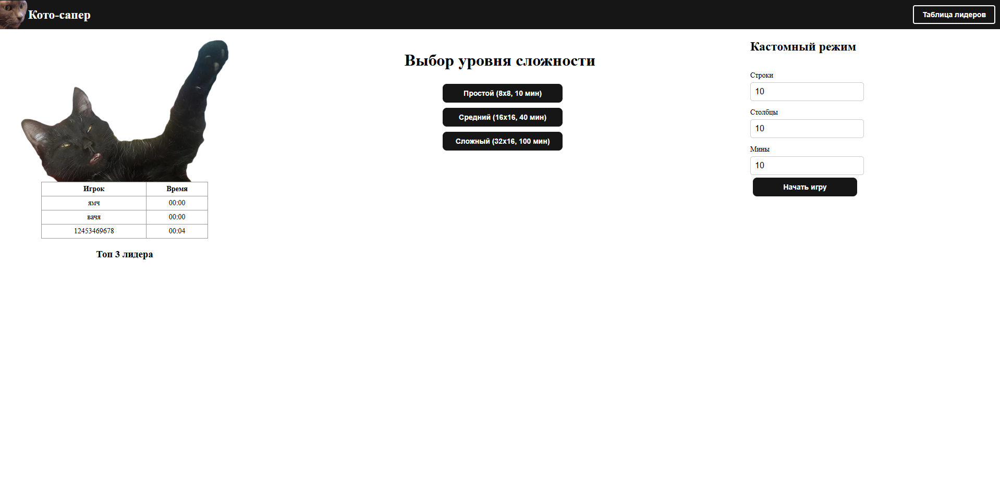
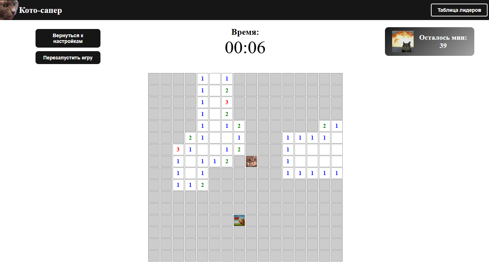
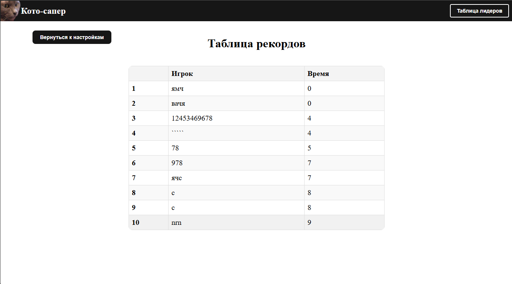

# Игра "Кото-Сапер"

## Оглавление

1. [Описание проекта](#описание-проекта)
2. [Правила игры](#правила-игры)
3. [Функциональные требования](#функциональные-требования)
4. [Технологический стек](#технологический-стек)
5. [Установка и запуск](#установка-и-запуск)
6. [Скриншоты](#скриншоты)

## Описание проекта

"Кото-Сапер" - это реализация классической игры "Сапер", где вместо мин, флажков и вопросика используются милые котики! Игроку нужно открыть все безопасные клетки на игровом поле, избегая клеток с взрывными котиками. Игра включает несколько уровней сложности, таблицу лидеров и возможность настроить игровое поле под свои параметры.

## Правила игры

Игровое поле — прямоугольник из клеток. В начале игры все клетки "закрыты". Мины размещаются случайным образом, но первая открытая клетка всегда безопасна.

### Открытие клеток:

- Если в клетке мина, игрок проигрывает.
- Если в соседних клетках есть мины, клетка показывает их количество.
- Если рядом с клеткой нет мин, автоматически открываются соседние клетки.

### Метки:

- Правая кнопка мыши позволяет поочередно ставить метки:
  - Флажок: предполагаемая мина.
  - Вопросик: неуверенность.
  - Пусто: убрать метку.

### Победа:

- Все безопасные клетки открыты.
- Все мины помечены флажками.

## Функциональные требования

### Основные возможности:

- **Выбор уровня сложности:**
  - Простой: поле 8×8, 10 мин
  - Средний: поле 16×16, 40 мин
  - Сложный: поле 32×16, 100 мин
- **Игровая механика:**
  - Автоматическое открытие соседних пустых клеток.
  - Цветовые обозначения цифр (1-8) в зависимости от количества мин вокруг.
  - Циклическая смена меток правой кнопкой мыши (флажок - вопросик - пусто).
- **Условия завершения игры:**
  - Поражение: открытие клетки с миной.
  - Победа: все безопасные клетки открыты, все мины помечены флажками.
  - Автоматическая остановка таймера при завершении игры.
- **Таблица лидеров:**
  - Хранит топ-10 результатов игроков с наименьшим временем.
  - Сортировка по времени (по возрастанию).
  - Данные сохраняются в LocalStorage.
  - Доступна на отдельном роуте `/leaderboard`.

### Дополнительные возможности:

- Пользователь может задать размер поля и количество мин.
- При первом ходе гарантируется отсутствие мины.
- Автоматическая победа, если открыты все клетки, на которых нет мин;
- Корректная работа на устройствах с шириной экрана от 320px.

## Технологический стек

- **Фреймворк:** Vue.js
- **Состояние:** Vuex 
- **Хранилище данных:** LocalStorage
- **Стилизация:** CSS 


## Запуск проекта

### Установка зависимостей

```bash
npm install
```

### Запуск сервера

```bash
npm run serve
```

## Скриншоты

### 1. Экран настроек
На экране настроек игрок может выбрать уровень сложности (Простой, Средний, Сложный) или задать собственные параметры игрового поля (размер и количество взрывные котики).


### 2. Игровое поле
Игровое поле отображает клетки, которые игрок может открывать. Таймер и счётчик котиков находятся в верхней части экрана. Игрок может ставить метки (флажки или вопросики) на клетки, где предполагаются взрывные котики.


### 3. Таблица лидеров
Таблица лидеров отображает топ-10 игроков с наименьшим временем. Данные сохраняются в LocalStorage и доступны на отдельной странице.
